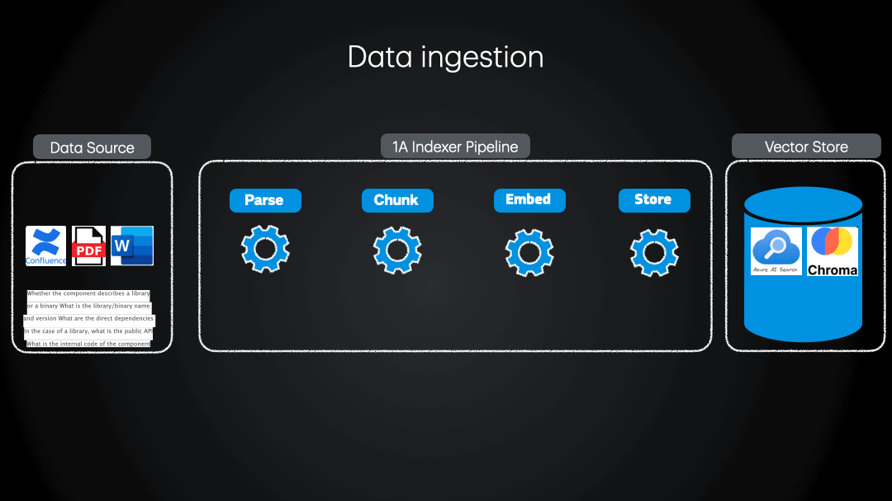

# Overview
This tool, `docs2vecs` is a library/cli that allows you to vectorize your data, enabling you to create RAG powered applications.




For these applications, `docs2vecs` simplifies the entire process:
* Data ingestion: Use the `indexer` to run the data ingestion pipeline: data retrieval, chunking, embedding, and storing resulting vectors in a Vector DB.
* Build proof of concepts: `docs2vecs` allows you to quickly create a RAG prototype by using a local ChromaDB as vector store and a `server` mode to chat with your data.


The `docs2vecs` project is managed with [uv](https://docs.astral.sh/uv/).

# Usage
You can use `docs2vecs` in three ways:
1. Install from PyPI
2. Install locally from source
2. Run from Docker/Podman image.

## Install from PyPI
You can install `docs2vecs` from PyPI using pip:
```sh
pip install docs2vecs
```
or
```sh
pip install docs2vecs[all]
```
to install all the extra dependencies.

## Run locally from source
```sh
gh repo clone AmadeusITGroup/docs2vecs
cd docs2vecs
uv run --directory src docs2vecs --help
```

## Run from Docker image

```sh
export OCI_ENGINE=podman # or docker
export DOCS2VECS_VERSION=latest # or a specific version
${OCI_ENGINE}  run -it --rm \
    ghcr.io/amadeusitgroup/docs2vecs:latest \
    --help # or any other valid command that can be run with docs2vecs
```

# Documentation

<details><summary>Expand me if you would like to find out how to vectorize your data</summary>

## Indexer sub-command

The `indexer` sub-command runs an indexer pipeline configured in a config file. This is usually used when you have a lot of data to vectorize and want to run it in a batch.

```bash
uv run --directory src docs2vecs indexer --help

usage: docs2vecs indexer [-h] --config CONFIG [--env ENV]
options:
--config CONFIG  Path to the YAML configuration file.
--env ENV        Environment file to load.
```

The `indexer` takes in input two arguments: a **mandatory** config file, and an **optional** environment file.

In the config file you'll need to define a list of skills, a skillset, and an indexer. Note that you may define plenty of skills, but only those enumerated in the skillset will be executed in sequence.

Example:

```bash
uv run --directory src docs2vecs indexer --config ~/Downloads/sw_export_temp/config/confluence_process.yml --env ~/indexer.env
```

**Please check the [detailed skills documentation](docs/readme/indexer-skills.md).**

The config yaml file is validated against [this schema](./src/docs2vecs/subcommands/indexer/config/config_schema.yaml).

Please check [sample config file 1](docs/readme/sample-config-file-1.yml), [sample config file 2](docs/readme/sample-config-file-2.yml) for your reference.

</details>

<details><summary>Expand me if you would like to find out how to chat with your data</summary>

## Server sub-command

If you previously indexed your data (refer to the previous section) and stored the outputted embeddings in a local ChromaDB, you can chat with your data using the `server` sub-command.

```bash
uv run --directory src docs2vecs server --help

usage: docs2vecs server [-h] [--host HOST] [--port PORT] [--model MODEL] [--cache_dir CACHE_DIR] [--path PATH]
                        [--workers WORKERS] [--log_level LOG_LEVEL] [--env ENV]

options:
  -h, --help            show this help message and exit
  --host HOST           A host for the server.
  --port PORT           A port for the server.
  --model MODEL         A name of the embedding model(as per huggingface coordinates).
  --cache_dir CACHE_DIR
                        A path to the cache directory.
  --path PATH           A path for the server.
  --workers WORKERS     Number of workers for the server.
  --log_level LOG_LEVEL
                        Log level for the server.
  --env ENV             Environment file to load.
```
By default, the host is `localhost` and the port is `8008`.

Example:
```bash
uv run --directory src docs2vecs server --path path/to/where/your/chroma/db/is
```
By then typing `http://localhost:8008/` in your browser, you sould be able to see the embedding collections stored in your vector store and perform Knn search based on user query. You can modify the K number of nearest neighbours returned by the semantic search.
</details>


<details><summary>Expand me if you would like to find out how create an integrated vectorization in Azure</summary>

## Integrated Vectorization sub-command
`integrated_vec` - Run an integrated vectorization pipeline configured in a config file.

```bash
uv run --directory src docs2vecs integrated_vec --help

usage: docs2vecs integrated_vec [-h] --config CONFIG [--env ENV]
options:
--config CONFIG  Path to the YAML configuration file.
--env ENV        Environment file to load.
```

Example:

```bash
uv run --directory src docs2vecs integrated_vec --config ~/Downloads/sw_export_temp/config/config.yaml --env ~/integrated_vec .env
```

The config yaml file is validated against [this schema](./src/docs2vecs/subcommands/integrated_vec/config/config_schema.yaml).

Config `yml` file sample:

```yaml
---
integrated_vec:
    id: AzureAISearchIndexer
    skill:
        type: integrated_vec
        name: AzureAISearchIntegratedVectorization
        params:
            search_ai_api_key: env.AZURE_AI_SEARCH_API_KEY
            search_ai_endpoint: http://replace.me.with.your.endpoint
            embedding_endpoint: http://replace.me.with.your.endpoint
            index_name: your_index_name
            indexer_name: new_indexer_name
            skillset_name: new_skillset_name
            data_source_connection_string: ResourceId=/subscriptions/your_subscription_id/resourceGroups/resource_group_name/providers/Microsoft.Storage/storageAccounts/storage_account_name;
            data_source_connection_name: new_connection_name
            encryption_key: env.AZURE_AI_SEARCH_ENCRYPTION_KEY
            container_name: your_container_name

```
</details>

## Important note:
Please note that **api keys** should **NOT** be stored in config files, and should **NOT** be added to `git`. Therefore, if you build your config file, use the `env.` prefix for `api_key` parameter. For example: `api_key: env.AZURE_AI_SEARCH_API_KEY`.

Make sure you export the environment variables before you run the indexer. For convenience you can use the `--env` argument to supply your own `.env` file.

Generate and use Scroll Word Exporter API tokens from the Personal Settings section of your Confluence profile.

## Experimental features
<details><summary>Tracker</summary>

### Tracker

The tracker feature allows you to monitor and manage the status of documents processed by the indexer. This is particularly useful for tracking failed documents and retrying their processing.

To achieve this, the tracker needs a `MongoDB` connection, which can be defined in the input config file.

The way it works is that each document in `MongoDB` has a `chunk` part having a `document_id`. This `document_id` is actually the hash of the content for that chunk. So, as long as the content is the same, the hash will stay the same. Besides this, there is a `status` property that keeps track whether the upload to vector store was successful or not.

If you'd like to use a different database to keep track of this, you'll have to write your own "driver" similar to the existing [mongodb](./src/docs2vecs/subcommands/indexer/db/mongodb.py). Then you need to add it to the [DBFactory](./src/docs2vecs/subcommands/indexer/skills/factory.py).
</details>

# Development

To run tests with pytest:

    uv python install 3.11
    uv sync --all-extras --dev
    uv run pytest tests


It is also possible to use tox::
    
    uv pip install tox
    uv run tox

Note, to combine the coverage data from all the tox environments run:

| OS      | Command                            |
| :---    | :---                                |
| Windows | `set PYTEST_ADDOPTS=--cov-append tox`   |
| Other   | `PYTEST_ADDOPTS=--cov-append tox`       |

# Releasing
To release a new version of the package, you can create a pre-release from the main branch using GitHub UI, which will then trigger the release workflow. Alternatively, you can use the `gh` command line tool to create a release:

```bash
gh release create v[a.b.c] --prerelease --title "Kick starting the release"  --target main
```

# Contributing
We welcome contributions to the `docs2vecs` project! If you have an idea for a new feature, bug fix, or improvement, please open an issue or submit a pull request. Before contributing, please read our [contributing guidelines](./CONTRIBUTING.md).